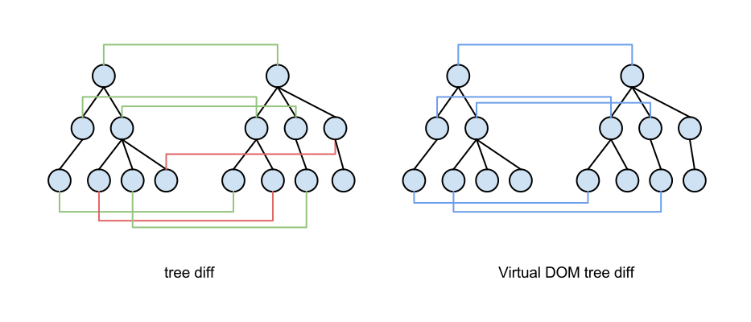
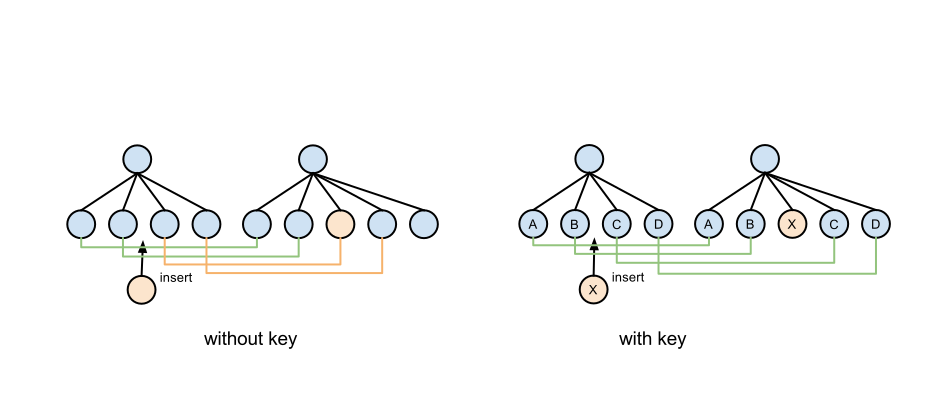
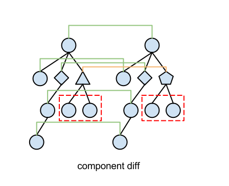
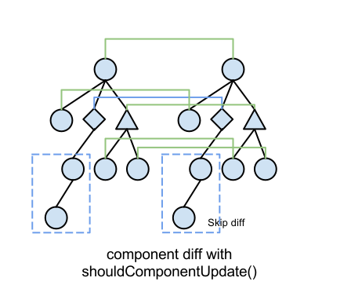

Virtual DOM 是 [React][1] 运作的核心，在了解 Virtual DOM 之前，
得先明白为什么需要这项技术。

<video autoplay loop><source type="video/mp4" src="./cover.mp4.gif"></video>
<!--more-->

## 传统 DOM 更新的问题
在传统的 Web 项目中，我们更新 UI 一般是这样的：
```js
var count = 0
$('button.add').on('click', function () {
  count++
  $('.count').text(count)
})
```

easy，目前来说没什么问题，而且代码也非常简单明了。
但往往在后续逻辑功能加入后变成了这样：
```js
var count = 0
$('button.add').on('click', function () {
  var newItem = $('input.text').val()
  $('ul.list').append('<li>' + newItem + '</li>')
  count++
  $('.count').text(count)
})
$('ul.list').on('click', 'button.remove', function () {
  count--
  $(this).closest('li').remove()
  $('.count').text(count)
})
```
问题已经慢慢暴露出来了：

1. 像 `$('.count').text(count)` 这种代码重复，而且应对 UI 这种复杂的环境根本无法封装复用起来。（DRY）
2. 功能代码和对 UI 的操作代码混在一起，多了就容易混乱。（M **VC**）

这只是一个简单的添加和删除的功能就已经成这样了，对于现在越来越高的交互要求特别是一些富应用，简直要死……

于是出现了一些用于简化 UI 更新的技术，比如 Two-way binding，还有就是 Virtual DOM。


## Virtual DOM 的算法
Virtual DOM 的初衷是基于“我们干脆直接每次更新整个 DOM tree 算了啊”这样任性的想法，
但 DOM 是在业界都知道的**特别特别的慢**，如果在 console 中列一下 DOM 的属性
`for (var key in document.body) console.log(key)`，随随便便滚几个屏。

所以 Virtual DOM 想了个办法来最少化对真实 DOM tree 的更新：使用 plain Object 作为对 DOM 的映射（也就是 Virtual DOM 名字的由来），比较更新前和更新后两个 Object 的 diff 再把该 diff patch 到真实 DOM 上。

大概是这个样子的：
```js
var before = {
  tag: 'div',
  children: [{
    tag: 'span',
    text: 'hi'
  }]
}
var after = {
  tag: 'div',
  attrs: {'class': 'active'},
  children: [{
    tag: 'span',
    text: 'hello'
  }]
}
var df = diff(before, after)
patch(df, dom)
```

很显然 diff 的结果应该是给 div 加上 active class，然后把 span 的文字改成 hello。
所以在于怎么计算得出这个结果才是重点。


### 树的 diff
由于对于树型结构求异是一个 O(n^3) 高复杂度的算法，Virtual DOM 丧心病狂地把它简化成了只比较同一位置的节点，这样复杂度就变成了 O(n)，既然如此好像也没有研究这个算法的必要了……



其实这种策略非常合理，因为在 UI 中 DOM 节点跨层级的移动非常少，完全可以忽略。

### 列表的 diff
但 UI 中列表的存在非常的普遍，除了在列表末尾插入新的节点外，节点间位移、插入也比较频繁，如果只按顺序遍历所有节点那势必会浪费很多无用的 DOM 更新。

所以 React 允许用户提供一个 key 来匹配相应的节点，达到优化列表的目的，就变成了这样：



ps. key 对于 list 的优化在 [Angular](https://docs.angularjs.org/api/ng/directive/ngRepeat#tracking-and-duplicates) 中也有类似的应用。


### Component diff
React 是基于组件构建应用的，对于组件间的比较采取的策略也非常简单：

1. 如果是同一类型（Class） 的组件，那就按之前的策略继续比较它的 virtual DOM tree。
2. 如果不是，那直接将该组件判断为 dirty，从而替换整个组件下的所有 real DOM tree（因为不同组件间存在相似 DOM tree 的机会很少）。




另外对于**同一类型**的组件，很有可能它的 Virtual DOM 没有任何变化，如果能够确切的知道这点那可以节省大量的 diff 时间，所以 React 允许用户实现 `shouldComponentUpdate()` 来判断需不需要再 diff 该组件。





## Event
在事件绑定上，React 也做了优化，使用了在传统 Web 中也经常用到的一个技巧就是事件代理（Event Delegation），从而减少事件绑定数。

在 jQuery 中是这样的：
```js
$('ul').on('click', 'li', fn)
```

不过 React 的实现更加特殊，它在真实的 DOM 根节点上只放了一个 Delegation 来监听所有事件，并将所有用户事件放入了一个 Map，并分配了基于在树中位置的 key，比如 `a.b.a`（这个 key 也会放到 DOM 的 `data-reactid` 属性中用于之后定位）。
而且事件的捕获和冒泡也不采取通常的方式在 Virtual DOM 的树结构中递归，而是直接通过这个 key 的分段来查找并触发事件，就这像这样：

```js
// click on a.b.a
clickCaptureListeners['a'](event)
clickCaptureListeners['a.b'](event)
clickCaptureListeners['a.b.a'](event)
clickBubbleListeners['a.b.a'](event)
clickBubbleListeners['a.b'](event)
clickBubbleListeners['a'](event)
```

这样做除了能优化性能外，也起到了统一事件避免各种浏览器（IE8） Event 坑的作用。

## 渲染
React 在渲染上也是用到常见的一些技巧比如将对 DOM 的更新尽量集中在一起避免浏览器多次重绘。

## 总结
Virtual DOM 其实并不怎么高深，它的那个 diff 算法甚至都算不上算法，但能把这套体系结合起来并成功套入到浏览器的 DOM 体系中确实非常了不起。而且这种思想可以套用到任何基于 tree 实现的 View System 中（比如 iOS），所以顺其自然地 React Native 出来了……

ps. 个人认为 binding 才是未来，Virtual DOM 的实现方式其实有点 tricky，但它确实是当下解决 DOM 问题的很好的手段，而且还能轻易切换到任意语言和平台。


----
## 参考资料
- [React][1]
- [React Performance][2]

[1]: http://facebook.github.io/react/
[2]: http://blog.vjeux.com/2013/javascript/react-performance.html
