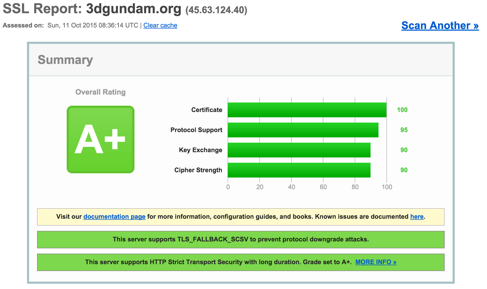
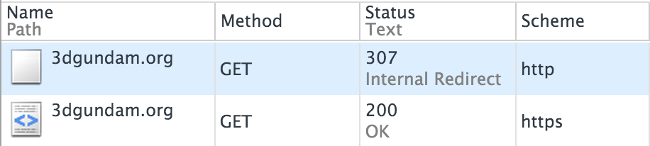

最近无聊试着通过 nginx 把部在 openshift 上的一个[论坛](https://3dgundam.org)反代，结果速度提升非常明显，顺便把 https 也加上了。

[][8]

因为之前基本没怎么研究过 nginx，这次也从中梳理了一遍 nginx 的针对生产环境的相关配置，在此做个记录。
<!--more-->

图省事的可以直接抄这个[配置][4]。


## proxy pass
也就是常说的反向代理，在生产环境中 nginx 一般以前端代理服务器存在，
负责把请求转发到相应的后端服务（python、nodejs 等）。对应的 nginx 指令为 `proxy_pass URL`，eg：

```nginx
server {
  listen 80;
  server_name example.com;

  location / {
    proxy_pass http://127.0.0.1:3000;
  }
}
```

其实到这里服务就已经可以正常访问了，但为了对后端服务友好，还需要加几项配置：

```nginx
server {
  listen 80;
  server_name example.com;

  location / {
    proxy_set_header HOST $host;
    proxy_set_header X-Forwarded-Proto $scheme;
    proxy_set_header X-Real-IP $remote_addr;
    proxy_set_header X-Forwarded-For $proxy_add_x_forwarded_for;

    proxy_pass http://127.0.0.1:3000;
  }
}
```

也就是添加修改几个 http headers，其中最重要的是`HOST`，因为经过 proxy pass 到达后端的请求的 HOST header 成了 nginx 访问后端的 host（127.0.0.1），修改这个头可以让服务器取得用户真实访问的 HOST 信息。

另外由于 http 协议**标准**中未包含客户端 ip 等信息，所以为了让后端能得到这些信息，业界**普遍**采用了几个非标准头 [X-Forworded Headers][1] 来解决（当然这也需要后端服务去读取这些头而不是直接使用 IP 包中的 ip 才行）。

此外有几个关于 [proxy buffer][7] 的指令基本不用改但需要关注一下。它们的价值在于当后端通过 nginx 向 client 响应内容时：`client <- nginx <- backend`，nginx 可以提前利用 buffer 接受完后端的响应尽快释放与后端的连接，就变成了这样：`client <- nginx`，在 client 与 nginx 连接比较慢的情况下非常有用。


### cache
这步是对上述反代的优化，缓存部分请求来解放后端工作量。eg：

```nginx
proxy_cache_path /tmp/nginx levels=1:2 keys_zone=cache1:8m inactive=16d max_size=128m;
server {
  listen 80;
  server_name example.com;

  location / {
    # ...
    proxy_cache cache1;
    proxy_cache_revalidate on;
    proxy_pass http://127.0.0.1:3000;
  }
}
```

- proxy_cache_path：用于配置一个缓存区，比较啰嗦具体见[文档][2]。
- proxy_cache：指定使用哪个缓存区。

除了上面两个必选项，再加上 `proxy_cache_revalidate on`，其它走默认即是最安全也是最符合 http 规范的配法：
- proxy_cache_revalidate：打开后可以复活过期的缓存（304 Not Modified），也就是说当某个缓存过期后，如果当初这个请求后端服务有提供 `Last-Modified` 或者 `ETag` 头的话，nginx 在这次请求后端服务时会带上 `If-Modified-Since` 或 `If-None-Match` 头，后端服务可以通过它们来判断直接返回 304 让 nginx 重新复用缓存。
- proxy_cache_methods：默认是 GET 和 HEAD，因为 http 规范中规定 POST 等含有副作用的请求不应该被缓存。
- proxy_cache_key: 默认是 `$scheme$proxy_host$request_uri`，包含了 URL query，同样符合 http 规范中的 query 不同，缓存也不应该相同，也就是 `/a.js?v=1` 和 `/a.js?v=2` 不应该使用同一个缓存。
- proxy_cache_valid：默认是根据后端服务器返回中的 http cache header（`Cache-Control` 和 `Expires`）来决定是否缓存和缓存时间，同样也与规范一致，[见][3]。
- proxy_cache_bypass：默认为空，这项指令的作用是在何种情况下强制重置缓存。很多地方建议设置成 `proxy_cache_bypass $http_cache_control`，也就是当客户端要求刷新缓存（<kbd>Ctrl</kbd>+<kbd>R</kbd>）时重置。但这么做会导致缓存命中率降低，只要能保证后端服务的 cache 信息可靠，完全不需要加上。

### fastcgi pass
这里顺便扯下 `fastcgi_pass`，它是除了 `proxy_pass` 外的另外一种常见的与后端服务通信的方式，
多用于 php（php-fpm）。

fastcgi 的优势是直接将解析完后的 http 请求发给后端服务，免去了解析 http 协议的工作（虽说 http 协议很轻……）。

另外如果后端服务是 python 的话，nginx 也有对 uwsgi 的支持，墙裂建议使用！[see][15]。

### 其它
- 如果 nginx 与后端服务部在同一台机子上的话可以直接使用 unix socket 来通信。
- 如果 nginx 与后端服务间有被中间人可能的话，可以通过 [https](http://nginx.org/en/docs/http/ngx_http_proxy_module.html#proxy_ssl_certificate) 或者 fastcgi+stunnel 来加密通信。最给力的是 uwsgi，能直接[支持 SSL](http://nginx.org/en/docs/http/ngx_http_uwsgi_module.html#uwsgi_pass)。


## https
上 https 得准备证书（废话），个人的话可以去 https://www.startssl.com 申请或者等这个 https://letsencrypt.org。

```nginx
server {
  listen       443 ssl;
  server_name  example.com;

  ssl_certificate      example.com.crt;
  ssl_certificate_key  example.com.key;

  location / {
    proxy_pass   http://127.0.0.1:3000;
  }
}
```

简单这样配置就可以工作了，但 https 有很多可优化的余地。

### session 缓存
由于 https 最费性能的就是密钥交换阶段，所以复用 session 非常重要。

```nginx
server {
  # ...
  ssl_session_cache    shared:SSL:8m;
  ssl_session_timeout  60m;
}
```

根据[官方文档](http://nginx.org/en/docs/http/ngx_http_ssl_module.html#ssl_session_cache)，cache 每 1M 可以缓存 4000 个 session，按情况调整。

另外还有一种复用 session 的方式为 `ssl_session_tickets`，它的优势是可以支持分布式，但浏览器支持率不够高。

### 调整算法安全
由于很多算法已被证明不安全，并不是启用全部算法就好，具体可以参考 [Mozilla 文档][5]。

```nginx
ssl_prefer_server_ciphers on;
ssl_protocols TLSv1 TLSv1.1 TLSv1.2;
ssl_dhparam dhparam.pem;
ssl_ciphers <CIPHERS>;
```

其中 dhparam 文件可以通过 `openssl dhparam -out dhparam.pem 2048` 来生成。

### 跳转非 https 请求并启用 HSTS
既然开了 https 当然希望所有用户使用 https 来访问本站，但有些用户习惯直接输入域名，如 `example.com` ，也就是通过默认的 http 访问。所以需要将 http 301 跳转到 https 上：

```nginx
server {
  listen 80;
  server_name .example.org;
  return 301 https://$host$request_uri;
}
```

虽然[部分浏览器默认会 cache 301 响应](http://stackoverflow.com/questions/9130422/how-long-do-browsers-cache-http-301s)，但这个缓存是针对 URL 的，不同的路径无法缓存依然会先请求再跳转，导致浪费一个请求，比如访问 `http://example.com/a` 之后再访问 `http://example.com/b` 并不能直接跳转到 https 上。

这个问题的解决办法是通过添加 `Strict-Transport-Security` http header 来使浏览器对该域名开启 HSTS（[大部分浏览器已支持](http://caniuse.com/#search=hsts)），之后当通过 http 访问该域名下的所有 URL 时，
浏览器会直接通过 307 跳转到 https 上。



配置：

```nginx
server {
  listen       443 ssl;
  server_name  example.com;
  # ...
  add_header Strict-Transport-Security max-age=31536000; # 1 year
}
```

### TLS SNI
古时候一个 ip 只能部署一个 https 服务，这是由于 https 协议需要交换证书后才能解密内容，而 Host 信息属于加密内容，自然 nginx 无法提前得知 Host 来指定不同的服务。

后来 TLS 有了个扩展用于解决这个问题：[SNI](https://en.wikipedia.org/wiki/Server_Name_Indication)，目前已被[绝大多数浏览器支持][6]。

SNI 不需要配置，只要 nginx 支持（通过 `nginx -V` 确认），然后放手添加 https server 就行。

<!--
通过 SNI 可以对 https 的范域名通过添加 server 来做更优雅的 301。
具体步骤为在原 server 添加 default_server 下（保证 SNI 不支持也能访问），
再添加一个 ssl server，填好需要跳转的 server_name，比较麻烦的是要再添加一遍证书，其它的跟 http 的 server 一样跳转就可以了。
-->

### Secure Cookie
启用了 https 的网站可以使用 [Secure Cookie](https://en.wikipedia.org/wiki/HTTP_cookie#Secure_cookie) 来加强安全性，
但为了使后端服务对 scheme 无关（最佳实践），最好由 nginx 来负责 cookie secure 化。

Secure Cookie 与普通 Cookie 的区别只是在 `Set-Cookie` header 后添加了一个 `Secure` 的 flag，像这样：`Set-Cookie:foo=bar; Secure`。但目前 nginx 还未提供添加该 flag 的指令，不过有两个 cookie 相关的指令也可以达到该目的：[proxy_cookie_domain](http://nginx.org/en/docs/http/ngx_http_proxy_module.html#proxy_cookie_domain) 和 [proxy_cookie_path](http://nginx.org/en/docs/http/ngx_http_proxy_module.html#proxy_cookie_path)。

就普遍性来说 path 更好（express 默认就会带上 path），所以建议使用 proxy_cookie_path 来实现：

```nginx
server {
  listen 443 ssl;
  # ...
  proxy_cookie_path ~^(.*)$ "$1; Secure";
}
```


## 总结
线上环境一般还需要配负载均衡，但目前只安了一个 openshift，论坛也没什么压力就没整，而且貌似 nginx 对于负载均衡这项听起来很高端的技术在配置上超简单，看[这里](http://nginx.org/en/docs/http/load_balancing.html#nginx_load_balancing_methods)。

折腾完后我成为了 nginx 大法的忠实信徒，nginx 并不是最快的（参考 erlang 实现的[各种服务器](https://github.com/search?o=desc&q=language%3Aerlang++server&ref=searchresults&s=stars&type=Repositories&utf8=%E2%9C%93)），
但它应该是在性能优异的同时，功能最为完善，配置上也非常友好（相比某直升机）的一个。
后端服务只需要实现 fastcgi 或者 http 就够了，专心做服务，
https、http2 还有性能优化等的工作就交给 nginx 来实现（所谓的肉盾 \_(:3｣∠)\_ ）。
<!--
- https/http2
- media stream
- ip block
- auth
- referer block
- ddos
- jwt?
-->

## 参考资料
- [Best nginx configuration for improved security(and performance)][4]
- [Understanding Nginx HTTP Proxying, Load Balancing, Buffering, and Caching][10]
- [You Should Be Using Nginx + UWSGI][16]
- [NGINX 配置 SSL 证书 + 搭建 HTTPS 网站教程][14]

[1]: http://docs.aws.amazon.com/ElasticLoadBalancing/latest/DeveloperGuide/x-forwarded-headers.html
[2]: http://nginx.org/en/docs/http/ngx_http_proxy_module.html#proxy_cache_path
[3]: http://nginx.org/en/docs/http/ngx_http_proxy_module.html#proxy_cache_valid
[4]: https://gist.github.com/plentz/6737338
[5]: https://wiki.mozilla.org/Security/Server_Side_TLS#Recommended_configurations
[6]: http://caniuse.com/#feat=sni
[7]: http://nginx.org/en/docs/http/ngx_http_proxy_module.html#proxy_buffer_size
[8]: https://www.ssllabs.com/ssltest/analyze.html?d=3dgundam.org&latest
[10]: https://www.digitalocean.com/community/tutorials/understanding-nginx-http-proxying-load-balancing-buffering-and-caching
[11]: https://www.digitalocean.com/community/tutorials/how-to-setup-fastcgi-caching-with-nginx-on-your-vps
[12]: https://www.digitalocean.com/community/tutorials/understanding-and-implementing-fastcgi-proxying-in-nginx
[13]: http://stackoverflow.com/questions/14655661/node-js-http-listen-on-local-unix-pipe-socket
[14]: https://s.how/nginx-ssl/
[15]: http://www.peterbe.com/plog/fcgi-vs-gunicorn-vs-uwsgi
[16]: http://cramer.io/2013/06/27/serving-python-web-applications/
