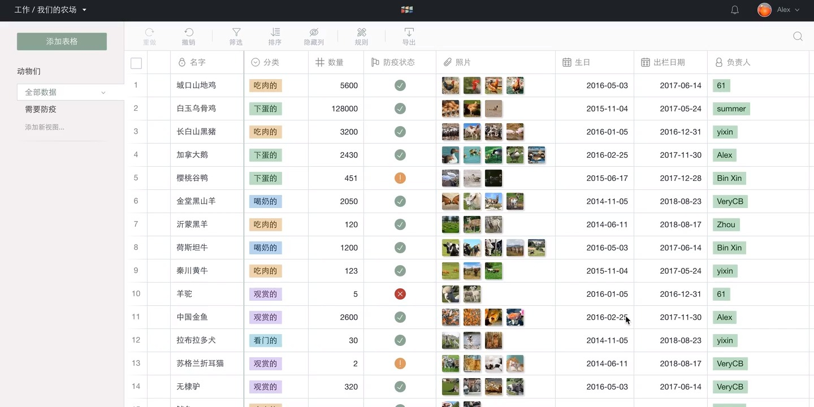

# 忻斌
90 年，男；
主修前端，辅修 Web 开发相关的各种技能，认同 [RoR 的开发理念](https://guides.rubyonrails.org/getting_started.html#what-is-rails-questionmark:~:text=Don%27t%20Repeat%20Yourself,endless%20configuration%20files.)；
热爱开源，为多个开源项目提过 [PR](https://github.com/pulls?q=is%3Apr+author%3Arhyzx+archived%3Afalse+is%3Apublic+is%3Aclosed)（eg.  [Babel](https://github.com/babel/babel/pulls?q=author%3Arhyzx)、[Vue](https://github.com/vuejs/vue/pulls?q=author%3Arhyzx)、[jQuery](https://github.com/jquery/jquery/pulls?q=author%3Arhyzx)、[Async](https://github.com/caolan/async/pulls?q=author%3Arhyzx)）；
乐于学习新技术与钻研工程最佳实践，略有代码洁癖；

- 邮箱：rhyzix@gmail.com
- 电话：17326069639
- 学历：专科（2008–2011 浙江金融职业学院 国际金融）
- GitHub：https://github.com/rhyzx

## 专业技能
- 精通 Javascript
- 了解 HTTP 协议，熟练使用 RoR、Nodejs、PHP 等技术进行 RESTful 服务开发
- 熟悉 PostgreSQL 与基本的 SQL 性能优化
- 熟悉 Linux 环境与 Git 版本管理
- 了解 Docker 并熟练使用 Kubernetes 进行产品部署
- 了解微信小程序与小游戏开发
- 了解 WebGL 与部分游戏实时渲染技术
- 了解区块链技术，参与过 DeFi 合约开发
- 了解 Rust

## 项目经历

### 2018–2021 @[YIZ](https://yiz.design/) #技术负责人
新媒体创业公司，维护公司的各类设施，如基于 Kubernetes 进行应用部署、证书自动申请（letsencrypt）、[CDN证书自动同步](https://github.com/YIIZ/sync-qcloud-cdn-cert)

参与各类营销类 H5 页面、HTML5 游戏、小程序、小游戏的前后端开发，主要技术栈为 Pixi.js、Three.js、Rails、Elixir/Phoenix 和 Nodejs；
一些可访问的 demo：[LOL十周年庆H5](https://demo.yiz.design/lol-10th/)、 [LOL寻找本命导师](https://demo.yiz.design/lol-sentinels/)、[LOL暗星皮肤](https://demo.yiz.design/loldark/)、[OPPO答题测试](https://demo.yiz.design/oppo-coloros/index.html)、[太空梦](https://demo.yiz.design/space-dream/)、[王者听力测试](https://demo.yizidesign.com/kof-hearing-test/index.html)、[虚幻争霸](http://demo.yiz.design/qq-paragon)

### 2016–2017 *[Treation](https://web.archive.org/web/20210118154809/https://treation.com/)* #开发 #远程工作
<!--  -->

一个类 Airtable 的表格数据管理工具。
主导该项目的前端工作，基于 Vue、BS4、Actioncable，主要精力花在表格的编辑功能开发与性能优化上；
参与部分后端任务，基于 Rails。

### 2015–2016 *[有道云笔记](https://note.youdao.com/)* @网易 #开发
参与云笔记 2.0 改版任务，推进部分技术迭代 (比如 SVG icons、[组件化](https://www.dropbox.com/s/0y3jsd3qmjw6pje/some-angular-best-practices.pdf?dl=0))，
独立负责部分功能 (比如 PDF 预览、任务管理、日历等)，并使用 Node 完成其中一些功能的接口；
负责一些效率工具的开发 (比如基于 [mincer](https://github.com/nodeca/mincer) 的一个静态资源构建系统，用于快速开发静态网页)。

### 2014–2015 *WolfeCareer* #web 开发
一个业余参与的创业项目，主要负责部分技术选型和前后端开发任务。
该项目后端主要基于 Pyramid (Python)，前端则是 Angular 和 Grunt，
另外还使用了 Docker 进行开发环境部署，可见 [sample-pyramid-app-with-docker-and-fig](https://github.com/rhyzx/sample-pyramid-app-with-docker-and-fig)。

### 2015–2015 *云 OS 4.0* @阿里云 #前端
一个类似 WebOS 的手机系统，应用开发语言为基于 Node 的 JavaScript，
主要负责 SDK 的部分 API 设计工作。

### 2014–2015 *[酷盘](https://web.archive.org/web/20150315002405/https://kanbox.com/)* @阿里云 #web 开发
类 Dropbox，基于 Rails 开发，负责前端开发和部分后端工作 (主要是 VC 层) 。
前端技术上主要继承了 Rails 默认的体系，如 CoffeeScript、Sass、jQuery + UJS、Turbolinks、Sprockets (前端工具链)，
另外主要还使用了 Backbone 和 Bootstrap，并使用 rails-assets 进行 Bower 的组件管理。

### 2014–2014 *uDATA* @淘宝 UED #web 开发
基于 Chrome 的一个数据可视化插件 (基于 D3)，中途加入参与部分新特性的开发。
之后负责新版重构，使用 Node 搭建后端服务，使之脱离原先的由另一 Java 团队开发的接口，直连淘宝的数据服务。
技术上主要基于淘宝的 Midway (Express 封装)，model 层使用了 Bookshelf。

### 2013–2014 *ATA社区* @淘宝 UED #web 开发
公司的一个内部技术社区，基于 PHP 开发。参与老版的维护工作，之后负责新版的前端架构搭建和部分后端技术选型，
使用了 CoffeeScript、Less、Brunch、Bootstrap、Bower、Sundown、Twig 等大量开源项目。
另外负责大部分前端页面开发与后端 VC 层的开发任务。

### 2012–2013 *[爱图购主站](https://web.archive.org/web/20121213231502/http://itugo.com/)* @九言科技 #前端开发
中途加入的项目，项目使用 Seajs 进行 JS 模块化和 Less 动态化 CSS，并使用 Git 进行版本控制。
主要任务是参与网站开发，项目中积极优化和组件化代码并提出一些优点意见，如为 Less 引入了 Bootstrap 的 mixin 库。
之后项目切换到 Grunt 进行自动化项目构建和 Swig 模板，全面切换到 Node 进行开发。

### 2012–2012 *[爱图购 H5 版](https://web.archive.org/web/20150321091411/http://m.itugo.com/bestbuy)* @九言科技 #前端开发
独立完成的项目，用于承接 iPhone 用户。
主要有图片瀑布流和内页异步滑动切换。
使用了原生 JS 构建，全面应用了 HTML5 特性。
根据需要写了一个轻量的 mobile slide 组件。

### 2011–2012 @核新同花顺公司 #开发
这段时间主要参与了多个证券系统的前端开发，独立完成各种前端任务，
解决浏览器兼容性问题并优化页面，另有少部分参与后端的开发。

## 个人项目

### [RUI](https://github.com/YIIZ/rui) 2019
基于 Reactive 实现的 UI 数据绑定系统，主要诉求是轻量（8k 实现[TodoMVC](https://yiiz.github.io/rui/todomvc/)）、低理解成本、兼容 JSX、跨 UI（[HTML](https://github.com/YIIZ/rui/blob/master/src/html.js)、[PIXI](https://github.com/YIIZ/lib/blob/master/rui/pixi/nodes.js)）以应对 H5 这种混合 HTML 和 Canvas 的环境。
并基于该系统实现了许多常用组件，如[路由](https://github.com/YIIZ/lib/blob/master/rui/router.js)、[Spring 动画](https://github.com/YIIZ/lib/blob/master/rui/motion.js)。

### [activestorage-tencent_cos](https://github.com/YIIZ/activestorage-tencent_cos) 2018
腾讯云 COS 的 Rails ActiveStorage 实现

### [lt](https://github.com/rhyzx/lt) 2013
一个极简的**试验型** JS 模板引擎。
语法上实现了 [{{Mustache}}](http://mustache.github.com/)，适合前端轻量级的内容渲染。

### [php-yaf-extras](https://github.com/rhyzx/php-yaf-extras) 2013
PHP [Yaf](http://php.net/manual/en/book.yaf.php) 框架的扩展包，主要用于 ATA 项目。
- 扩展了对 RESTful 路由的支持。
- 添加了对不同模板引擎的支持用于引入 Twig 模板引擎。
- 扩展了 controller 多个实用的方法比如对 flash message 的支持。

### [node-fluent-stream](https://github.com/rhyzx/node-fluent-stream) 2012
简化 Node Stream 数据流处理的工具。
初衷是在写代理工具的时候发现处理字节流非常蛋疼。
实现了 Node 的 Stream 接口，可以很优雅地和各类流拼接。
另外在这个项目开始尝试引入 Travis ci 来自动化测试。

